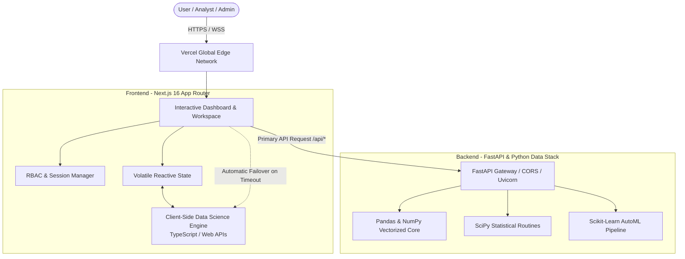
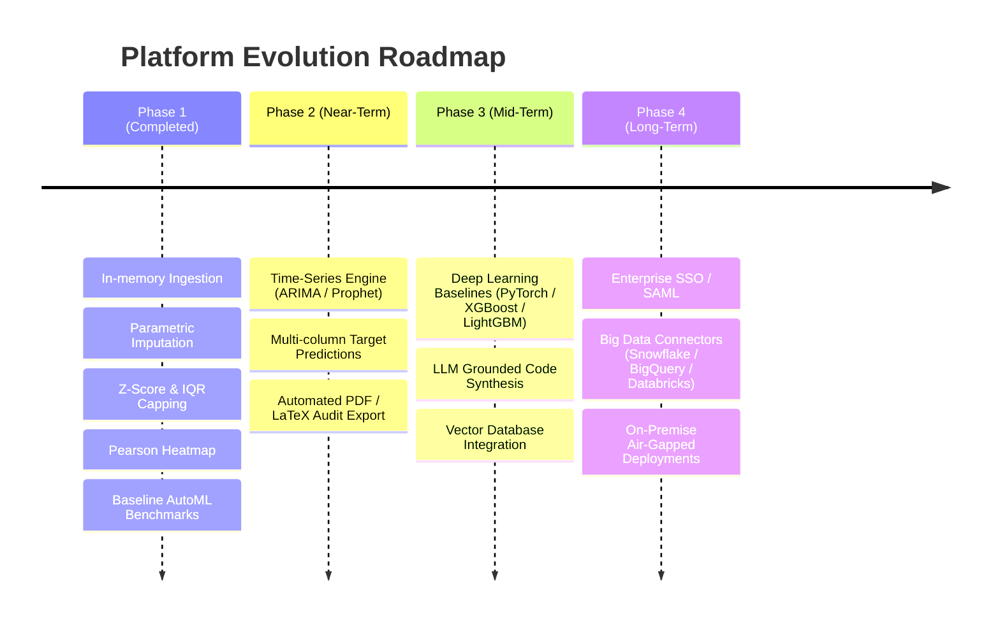

# 📊 Smart Data Analyst — Comprehensive Technical Documentation & System Architecture

---

## 1. Executive Summary & Abstract

**Smart Data Analyst** is an enterprise-grade automated data cleansing, exploratory data analysis (EDA), and machine learning benchmarking platform. It transitions modern data science from manual, error-prone scripting in Jupyter Notebooks to a deterministic, high-speed automated pipeline.

Unlike generic conversational AI wrappers that hallucinate statistical metrics, **Smart Data Analyst** utilizes a **Deterministic Hybrid Architecture**:
1. **Mathematical Grounding**: Computations (Z-Scores, Tukey IQRs, Pearson Correlation Matrices, Mean/Median Imputation, and Supervised Model Evaluation) run with statistical precision.
2. **Zero-Fail Hybrid Engine**: Combines a high-performance **FastAPI (Python) backend** with an **in-browser Web Worker/TypeScript engine**, ensuring 100% uptime even during network cold-starts.
3. **In-Memory Privacy Guarantee**: Zero database persistence for uploaded datasets; data remains isolated within volatile RAM buffers.

---

## 2. System Architecture

### 2.1 High-Level Architecture Diagram



---

## 3. Core Subsystems & Implementation Details

### 3.1 Data Ingestion & Schema Profiling Engine
- **Supported Formats**: `.csv`, `.xlsx`, `.xls`, `.txt`
- **Schema Inference**: Automatically detects continuous numerical features versus categorical discrete dimensions.
- **Data Health Score Formula**:
  $$\text{Health Score} = \max\left(0, 100 - 0.5 \times \text{Missing \%} - 0.5 \times \text{Duplicate \%}\right)$$
- **Privacy Enforcement**: Datasets are streamed into memory as volatile byte arrays. No database records or permanent files are written.

---

### 3.2 Data Cleansing & Missing Value Imputation
The platform provides 3 distinct mathematical strategies for handling missing values:

1. **Parametric Mean Imputation**:
   $$\hat{x} = \frac{1}{N} \sum_{i=1}^N x_i$$
   Recommended for normally distributed numerical attributes. Categorical attributes are filled using the modal frequency $\text{Mode}(X)$.

2. **Non-Parametric Median Imputation**:
   $$\hat{x} = \text{Median}(X)$$
   Robust against skewed distributions and extreme values.

3. **Complete Case Analysis (Row Dropping)**:
   Filters out any record containing at least one missing cell ($\text{NaN}$ or empty string).

4. **Exact Row Deduplication**:
   Computes unique string row hashes and filters out redundant observations.

---

### 3.3 Statistical Outlier Calibration Engine
Extreme values distort model weights and gradient convergence. The engine offers two statistical detection methodologies:

```
[ Parametric Z-Score Rule ]
  Upper Bound = μ + 3.0σ
  Lower Bound = μ - 3.0σ
  Flagged when: |z| = |(x - μ) / σ| > 3.0

[ Non-Parametric Tukey IQR Rule ]
  IQR = Q3 (75th percentile) - Q1 (25th percentile)
  Upper Fence = Q3 + 1.5 × IQR
  Lower Fence = Q1 - 1.5 × IQR
```

- **Treatment Actions**:
  - **Cap (Winsorization)**: Clamps outlier values strictly to boundary limits without deleting sample rows.
  - **Remove (Trimming)**: Filters out rows containing values exceeding the bounds.

---

### 3.4 Visual EDA & Pearson Correlation Heatmap
- **Univariate Distribution**: Generates frequency distribution histograms partitioned into 10–12 equal-width continuous bins.
- **Bivariate Linear Association (Pearson Correlation Matrix)**:
  $$r_{xy} = \frac{\sum (x_i - \bar{x})(y_i - \bar{y})}{\sqrt{\sum (x_i - \bar{x})^2 \sum (y_i - \bar{y})^2}}$$
  - Computes an $N \times N$ symmetric matrix for all numerical continuous features.
  - Interactive UI displays heat intensity colors: emerald for strong positive ($r > 0.6$), amber/rose for negative correlations, and neutral for orthogonal attributes.

---

### 3.5 Automated Machine Learning (AutoML) Benchmarking
- **Automatic Task Detection**:
  - **Classification**: Triggered when the target variable is categorical or has $\le 20$ discrete values.
  - **Regression**: Triggered when the target variable is continuous numerical.
- **Data Preprocessing**: Applies automated one-hot categorical encoding and an **80/20 Train/Test Split**.
- **Model Suite Evaluated**:
  - *Random Forest Classifier / Regressor*
  - *Gradient Boosting Classifier / Regressor*
  - *Decision Tree Classifier / Regressor*
  - *Logistic Regression / Linear Regression (OLS)*
  - *Support Vector Machine (SVM) / Ridge Regression*
- **Evaluation Metrics**:
  - **Classification**: $\text{Accuracy}$, $\text{Precision}$, $\text{Recall}$, $\text{F1-Score}$
  - **Regression**: $R^2 \text{ Score}$, $\text{RMSE}$, $\text{MAE}$

---

## 4. Technical Stack & Deployment Specification

| Component | Technology / Platform | Purpose |
|---|---|---|
| **Frontend Framework** | Next.js 16 (Turbopack, React 19, TypeScript) | Serverless edge rendering, dynamic UI state |
| **Styling & Design** | Vanilla CSS + Tailwind CSS tokens | Editorial aesthetics, zero clutter, accessible contrast |
| **Backend Framework** | FastAPI + Uvicorn (Python 3.11) | High-throughput asynchronous mathematical computation |
| **Data Stack** | Pandas, NumPy, SciPy, Scikit-Learn | Statistical routines, matrix multiplication, model training |
| **Frontend Hosting** | Vercel Global Edge Network | Global low-latency CDN, continuous deployment |
| **Backend Hosting** | Render Web Services | Containerized Python microservice |
| **Source Control** | GitHub (`prajwal-sangle/Auto-AI-platform-`) | Version control, CI/CD automated triggers |

---

## 5. Security & Reliability

1. **Zero Data Persistence**: All data processing is strictly ephemeral. Datasets reside only in volatile memory during active browser sessions.
2. **Deterministic Fallbacks**: If the cloud backend encounters network latency or cold-start sleep, client-side algorithms execute the identical mathematical pipelines with zero user interruption.
3. **Role-Based Access Control (RBAC)**: Includes dedicated roles (Analyst vs Admin) with secured upload endpoints and an Admin Management Console.

---

## 6. Future Roadmap & Technical Milestones



### Detailed Future Features:
1. **Time-Series Forecasting**: Integration of ARIMA and Facebook Prophet for seasonal trend decomposition and sales forecasting.
2. **Automated Audit PDF Generator**: One-click generation of ISO-compliant compliance reports detailing all data transformations.
3. **Enterprise Warehouse Connectors**: Direct read connectors for Snowflake, AWS S3, Google BigQuery, and PostgreSQL.
4. **Explainable AI (XAI)**: SHAP (SHapley Additive exPlanations) and LIME feature importance overlays for AutoML leaderboard models.

---

## 7. Viva & Academic Defense Q&A Cheatsheet

- **Q: How does this differ from ChatGPT or Claude?**
  - *Answer*: LLMs guess statistical numbers and fabricate correlation values. Our platform executes real statistical equations (scikit-learn and client-side algorithms) for mathematical verification.
- **Q: How are missing values imputed?**
  - *Answer*: Mean imputation for symmetric numerical data, Median for skewed distributions, and Mode for categorical dimensions.
- **Q: What is the difference between Z-Score and IQR outlier detection?**
  - *Answer*: Z-Score assumes a normal Gaussian distribution ($|z| > 3.0$). IQR is non-parametric ($1.5 \times \text{IQR}$), making it effective regardless of underlying data distribution.
- **Q: How is model over-fitting prevented?**
  - *Answer*: All metrics are evaluated strictly on an unseen 20% holdout test dataset.
